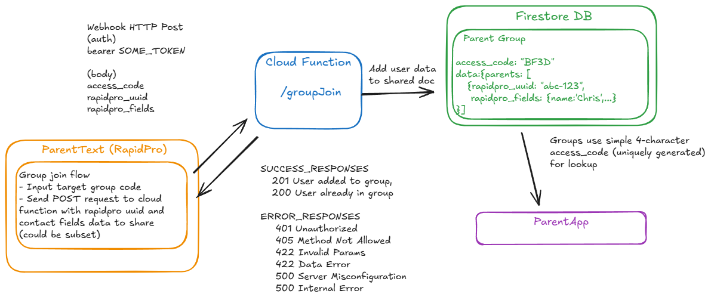

## Rapidpro Shared Data

This functions is used to enable syncing data between rapidpro and app shared-data firestore collections

It specifically enables rapidpro users to join the group via their rapidpro uuid, and sync contact data to shared

## TODOs

- [ ] Deployment test
- [ ] Deployment instructions
- [ ] Check whether `data.parentGroupData` necessary or just use top-level data
- [ ] If trying to join group again, should we use as a means to update latest data?... Probably not a good mechanism to rely on
