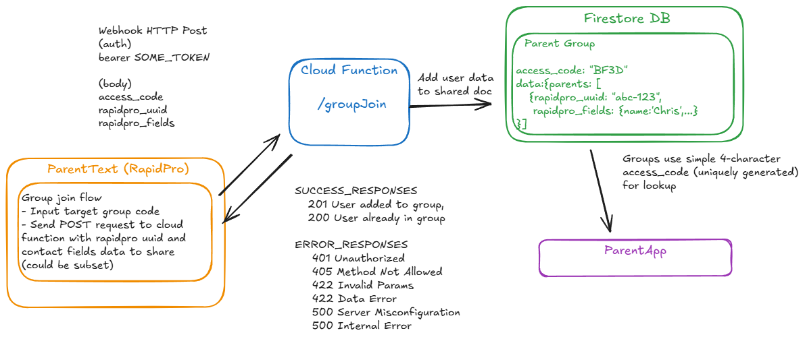

## Rapidpro Shared Data - Group Join

This function is used to enable syncing data between rapidpro and app shared-data firestore collections

It specifically enables rapidpro users to join the group via their rapidpro uuid, and sync contact data to shared



## TODOs

- [ ] Consider skipping initial data sync and doing via user-data sync callable function?

### Deploy

Ensure environment variables populated

```env
SHARED_DATA_UPDATE_TOKEN=
ALLOW_ORIGIN=
```

Deploy to firebase

```bash
firebase deploy --only functions:groupJoin
```
