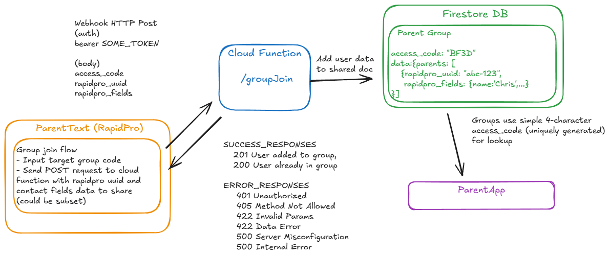

## Rapidpro Shared Data - Group Join

This function is used to enable syncing data between rapidpro and app shared-data firestore collections

It specifically enables rapidpro users to join the group via their rapidpro uuid, and sync contact data to shared



## TODOs

- [ ] Consider skipping initial data sync and doing via user-data sync callable function?

### Deploy

Ensure environment variables populated

```env
SHARED_DATA_UPDATE_TOKEN=
ALLOW_ORIGIN=
```

Deploy to firebase

```bash
firebase deploy --only functions:groupJoin
```

### Cross-Project Proxy
If you need `groupJoin` available from a second Firebase project, deploy `groupJoinProxy` to that second project. This allows for a parent app to add parents to a shared group for a facilitator app, via invoking a fucntion within the parent app's own project.

Set `GROUP_JOIN_REMOTE_URL` in the second project's environment variables to the HTTPS endpoint of `groupJoin` deployed in the first project.

```env
GROUP_JOIN_REMOTE_URL=https://us-central1-<project-id>.cloudfunctions.net/groupJoin
```

Also ensure the proxy project has the same `SHARED_DATA_UPDATE_TOKEN` configured (the proxy uses its env var to call the upstream `groupJoin`).

Deploy the proxy:
```bash
firebase deploy --only functions:groupJoinProxy
```
