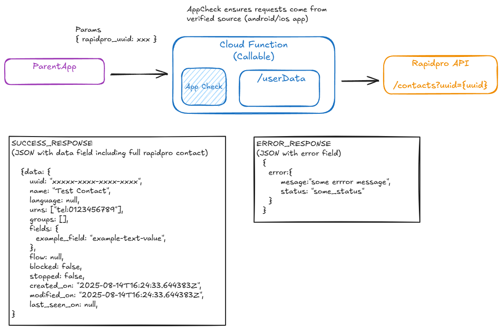

## Rapidpro Shared Data - User Data

Callable function to allow app to retrieve rapidpro user data on demand

Requests are validated using AppCheck to ensure only genuine app users are making requests. Data is returned directly and not persisted to firestore db for improved data protection.

